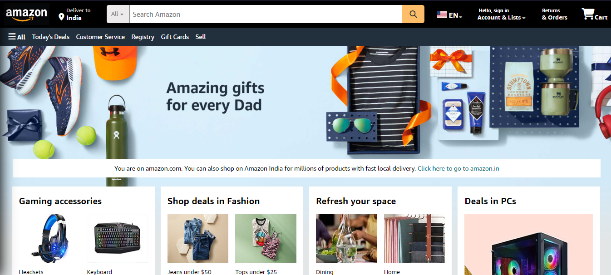

# Amazon UI Clone

This project is a clone of the Amazon website user interface, created using HTML, CSS, and JavaScript. It mimics the layout of the Amazon website to provide a familiar user experience.



## Features

- **Homepage:** Mimics the Amazon homepage layout with navigation bars and product listings.
- **Product Listings:** Displays products with images.
- **Footer:** Includes links to various sections such as About Us, Careers, and Contact Us, similar to the Amazon website.

## Installation

To run the Amazon UI clone locally, follow these steps:

1. Clone the repository:
   ```bash
   git clone https://github.com/Avyaaz18/AmazonUIClone.git
   ```
   
2. Navigate into the project directory:
   ```bash
   cd AmazonUIClone

---

